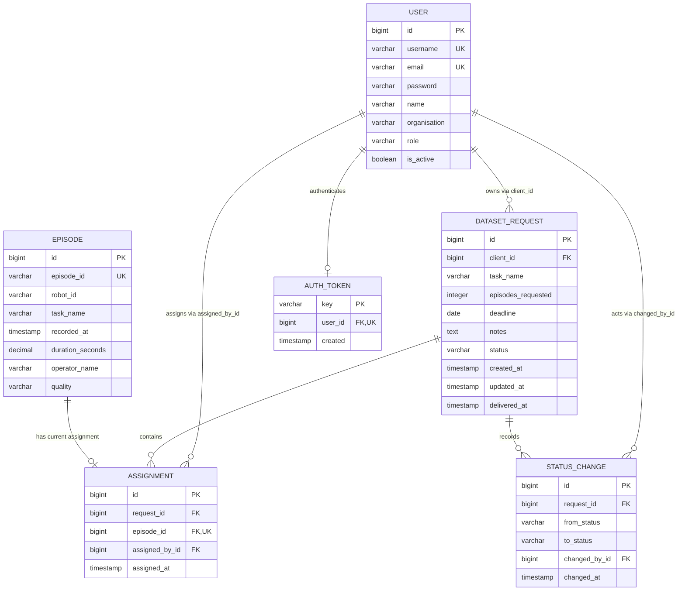

# Backend developer guide

This guide contains backend setup, testing, Postman examples, API reference, model structures, and implementation explanations. Return to the [project overview](../README.md) or read the [design notes](../NOTES.md).

## Run the backend (Windows PowerShell)

Prerequisites: Python 3.13 and a running PostgreSQL server. Clone this repository and open PowerShell in its root:

```powershell
git clone https://github.com/ManJoseph/NEOTIX-DRD.git
cd NEOTIX-DRD
py -3.13 -m venv .venv
.\.venv\Scripts\python.exe -m pip install -r requirements.txt
Copy-Item .env.example .env
```

Edit `.env` locally. Set `DJANGO_SECRET_KEY` to a newly generated secret, `DJANGO_DEBUG=True` for development, and `DB_NAME`, `DB_USER`, `DB_PASSWORD`, `DB_HOST`, and `DB_PORT` to your PostgreSQL connection settings. Generate a Django secret with:

```powershell
.\.venv\Scripts\python.exe -c "from django.core.management.utils import get_random_secret_key; print(get_random_secret_key())"
```

Create an empty PostgreSQL database matching `DB_NAME`, using pgAdmin or PostgreSQL's `createdb` tool. The application does not create this database. Then run:

```powershell
.\.venv\Scripts\python.exe manage.py check
.\.venv\Scripts\python.exe manage.py migrate
.\.venv\Scripts\python.exe manage.py createsuperuser
.\.venv\Scripts\python.exe manage.py runserver
```

`createsuperuser` prompts for your own username, email, and password and assigns the application `admin` role. There is no Django admin website. Use the admin API to create client/operator accounts. The whole-system launcher seeds reviewer users and records generated passwords locally; see README. Manual backend setup can instead use createsuperuser. `.env`, `.venv`, and local log files are ignored by Git.

Base URL: `http://127.0.0.1:8000`. Subsequent backend starts need only the `runserver` command while PostgreSQL is running. On Linux/macOS, create a virtual environment with `python3 -m venv .venv` and substitute `.venv/bin/python` for the Windows Python path.

## Run tests

```powershell
.\.venv\Scripts\python.exe manage.py test desk --noinput
```

Tests create and remove a separate `test_<DB_NAME>` database; the configured database user needs permission to create it. They do not populate your development database. The final full backend run passed all 99 tests. To focus on one area, replace `desk` with, for example, `desk.test_csv_import` or `desk.test_request_api`.

## Authentication and roles

POST `/api/auth/login/` with JSON:

```json
{"username": "<your username>", "password": "<your password>"}
```

Copy `token` from the response. All other endpoints, including `/health`, require the header `Authorization: Token <token>`. Use `Content-Type: application/json` for JSON bodies. These are opaque DRF database tokens, not JWTs. Tokens have no automatic expiry; logout revokes the user's token. One token is shared across that user's logins.

Clients can create requests and read/review only their own. Operators can read all requests, import inventory, assign episodes, change operational status, and read analytics. Admins have operator permissions plus account management. Authorization is enforced by the backend.

## API reference

All paths below are relative to the base URL. Keep trailing slashes except for `/health`.

| Method | Path | Access / purpose |
| --- | --- | --- |
| POST | `/api/auth/login/` | Public; username/password login |
| GET | `/api/auth/me/` | Authenticated; own profile |
| POST | `/api/auth/logout/` | Authenticated; revoke token, 204 |
| GET / POST | `/api/users/` | Admin; list/create accounts |
| GET / PATCH | `/api/users/<id>/` | Admin; read account/change role or activity |
| GET / POST | `/api/requests/` | List visible requests / client creates request |
| GET | `/api/requests/<id>/` | Read a visible request |
| GET | `/api/requests/<id>/history/` | Read its chronological status history |
| POST | `/api/requests/<id>/status/` | Role and transition restricted |
| GET | `/api/episodes/` | Operator/admin; filter inventory |
| POST | `/api/episodes/import/` | Operator/admin; upload CSV |
| GET / POST | `/api/requests/<id>/assignments/` | Read visible assignments / operator assigns |
| DELETE | `/api/requests/<id>/assignments/<assignment-id>/` | Operator/admin; remove assignment, 204 |
| GET | `/api/analytics/` | Operator/admin; date-range report |
| GET | `/health` | Authenticated; database connectivity |

Request, inventory, and assignment lists have 50 records per page and return `count`, `next`, `previous`, `results`. Use `?page=2`. User lists and status history are currently unpaginated. Successful creates return 201; other successful reads/updates return 200 unless shown above.

Validation errors return 400; missing/invalid credentials 401; denied roles 403; missing records or another client's requests 404. Database connectivity failures return a generic 503. Read-only input fields are ignored; the server supplies ownership, actors, status, and timestamps. There is no public registration or generic request update/delete endpoint.

## Postman walkthrough

1. Log in as your admin. POST `/api/users/` to create a client and an operator, choosing a password for each:

```json
{
  "username": "client@example.com",
  "email": "client@example.com",
  "name": "Example Client",
  "organisation": "Example Robotics",
  "role": "client",
  "password": "<choose a strong password>"
}
```

For the operator, choose a different username/email and `"role": "operator"`. Passwords are validated and hashed. PATCH a user's URL with `{"role":"operator"}` or `{"is_active":false}` to manage them. Deactivation revokes their token. Admins cannot deactivate or demote themselves.

2. Log in as the operator. POST `/api/episodes/import/`: Body → form-data, key `file`, type File, select `seed/episodes.csv`. Let Postman set the multipart Content-Type; remove any manually configured JSON Content-Type.
3. Log in as the client and POST `/api/requests/`:

```json
{"task_name":"pick cup","episodes_requested":1,"deadline":"2026-10-04","notes":"Training dataset"}
```

Choose today or a future Kigali date for the deadline; the sample date above may need updating. Past deadlines return a 400 field error. Existing requests can become overdue without being changed.

4. Save the returned request `id`. Using the operator token, POST its `/status/` URL with `{"status":"in_progress"}`.
5. GET `/api/episodes/?task_name=pick%20cup&quality=good&available=true`. Choose a returned episode's numeric `id`. POST the request's `/assignments/` URL with `{"episode":12}`, substituting that ID. The external `episode_id` such as `EP00001` is not the assignment input ID.
6. POST `/status/` with `{"status":"delivered"}`. Delivery requires at least the requested number of assignments.
7. Using the owning client's token, POST `/status/` with `{"status":"accepted"}` or `{"status":"rejected"}`. GET `/history/` to see who changed each status and when.
8. For rework, the operator moves `rejected` back to `in_progress`, removes/replaces assignments, and delivers again. DELETE an assignment releases its episode. Assignments can change only in `in_progress`.

Only good/usable, unassigned episodes with a matching normalized task can be assigned. Inventory quality filters accept `good`, `usable`, or `bad`; availability accepts `true` or `false`. Availability alone does not imply eligible quality. A client's attempt to read another client's request returns 404.

## CSV behavior

Required columns: `episode_id,robot_id,task_name,recorded_at,duration_seconds,operator_name,quality`. Header order may vary. UTF-8 (including BOM) uploads are limited to 5 MiB and 10,000 data records.

Values are trimmed; IDs uppercased; robot/quality/task lowercased; task whitespace collapsed. Known robots are `arm-01`, `arm-02`, `arm-03`, `mobile-01`, `humanoid-01`. Dates accept ISO timestamps or `DD/MM/YYYY HH:MM`; timestamps without offsets use Kigali time. Future recordings are skipped. Durations must be finite, positive, at most 3600 seconds, and fit two decimal places. Bad quality is valid inventory but cannot be assigned.

The first valid canonical episode ID wins. Identical duplicates and conflicting duplicates are skipped with different reasons; existing metadata is never overwritten. Responses contain `imported`, `skipped`, and `skipped_rows` with record number, episode ID, and reason. Record numbering includes the header and counts CSV records rather than physical lines. A 200 response can contain skipped rows: inspect the report.

The supplied fixture imports 172 and skips 19 records into an empty database with the October 2026 test clock. A repeat imports zero and skips 191. File syntax/header errors return 400 before writes. Invalid individual rows are skipped; unexpected database failures roll back the entire import.

## Analytics, health, and logs

GET `/api/analytics/?start_date=2026-08-01&end_date=2026-09-30`. Both dates are required, inclusive in `Africa/Kigali`. Output contains `episodes_per_day_per_robot`, `request_fulfilment` (`counts_by_status`, `median_delivery_seconds`), and `top_good_tasks`.

Episode statistics use recording dates. Requests use submission dates and their current status. The median measures submission to first delivery, even if delivery is outside the selected range; never-delivered requests are excluded. Empty medians return null, missing status counts zero. Top-task ties use alphabetical order.

Three ORM aggregation queries and one parameterized PostgreSQL `percentile_cont(0.5)` query compute results in the database. With 5 million episodes, Python receives only summary rows, but PostgreSQL still scans and aggregates matching data. Narrow ranges can benefit from the date/robot index; broad ranges may use sequential scans. Measure with `EXPLAIN ANALYZE` before adding indexes; frequent reports could use cached/daily summaries. No 5-million-row benchmark was performed.

GET `/health` returns `{"status":"ok","database":"ok"}` after a database connectivity check. It does not verify every table or migration. Request middleware writes one JSON console line containing UTC timestamp, method, path, status, duration_ms, and authenticated user_id (otherwise null). Tokens, passwords, bodies, and query strings are omitted. Full exception monitoring is not implemented.

## Code map

| File | Responsibility |
| --- | --- |
| `manage.py` | Django commands: migrations, tests, shell, server, initial admin |
| Project `settings.py` | Environment/database settings, authentication, middleware, logging |
| `desk/models.py` | Database structure, choices, constraints, indexes, admin user manager |
| `desk/migrations/` | Versioned schema changes |
| `desk/serializers.py` | Allowed input/output fields and input validation |
| `desk/permissions.py` | Business-role access checks |
| `desk/views.py` | Endpoint actions, ownership, workflow rules, transactions |
| `desk/urls.py` | API route → view mapping |
| `desk/pagination.py` | 50-record list pages |
| `desk/csv_import.py` | CSV parsing, normalization, validation, import reports |
| `desk/analytics.py` | Database aggregates and median query |
| `desk/middleware.py` | Request timing and JSON access logs |
| `desk/exceptions.py` | Safe database-unavailability responses |
| `desk/throttles.py` | Login attempt rate limit |
| `desk/tests.py`, `desk/test_*.py` | Automated behavior checks |

## How a request travels through the code

The URL selects a view. DRF's default token authentication identifies the caller; permissions determine whether their role may use the action. A client ownership filter limits the records they can access. A serializer checks supplied fields. The view applies cross-record business rules and writes through models into PostgreSQL. The response serializer formats the result. Request middleware surrounds this work, measures elapsed time, and emits a JSON log.

Authentication answers “who is calling?” Permissions answer “may they perform this action?” An ownership query answers “may they access this particular request?” All three are needed. Login explicitly allows unauthenticated access. The default for other actions is authenticated access, with additional role checks where needed.

## Models and relationships

`User`: standard Django username, unique email, hashed password, activity flags, plus name, organisation, and client/operator/admin role. `DeskUserManager` makes `createsuperuser` also set the business admin role. A Django superuser flag and the business role are different concepts; API authorization checks the business role.

`Episode`: one imported recording's metadata. Numeric `id` is the internal primary key; unique `episode_id` is the recording system's external ID. Duration is a decimal, not a float. Robot/quality choices make valid names explicit.

`DatasetRequest`: client foreign key, task, requested count, deadline, notes, current status, creation/update times, and nullable first delivery time. One client can have many requests.

`Assignment`: request foreign key, episode one-to-one field, assigning user foreign key, assignment timestamp. One request can have many assignments; one episode can have at most one current assignment. Deleting the link frees the episode without deleting its metadata.

`StatusChange`: request foreign key, previous/new status, actor foreign key, and timestamp. Initial submission uses an empty previous status. Rework adds events rather than replacing old history.

Business foreign keys use `PROTECT`, preventing accidental ORM deletion of referenced records. Database constraints reject invalid role/status/robot/quality values, nonpositive duration/count, and duplicate unique IDs or assignments. Model `save()` does not automatically run every validator: API/import validation and database constraints serve different purposes.

## Model structure tables

These tables describe the five application models in `desk/models.py`, including inherited user fields. Database column names are shown: Django relationship fields add `_id` to store the referenced primary key. `PK` means primary key; `FK` means foreign key; unique means duplicate values are forbidden. All fields are non-null unless explicitly marked nullable. Empty strings and SQL NULL are different: `blank=True` permits empty input but does not make a database column nullable. Django supplies each model's auto-incrementing `BigAutoField` ID.

### User — `desk_user`

| Field / column | Django type | Rules / default | Purpose |
| --- | --- | --- | --- |
| id | BigAutoField | PK, automatic | Internal user identifier |
| username | CharField(150), inherited | Unique | Login identifier |
| email | EmailField(254) | Unique | Email address |
| password | CharField(128), inherited | Django password hash | Stores hash, never raw password |
| name | CharField(150) | Required by normal account input | Application display name |
| organisation | CharField(150) | Blank allowed | Client/company name |
| role | CharField(10) | client/operator/admin; default client; DB check | Business permissions |
| first_name | CharField(150), inherited | Blank allowed | Standard Django field |
| last_name | CharField(150), inherited | Blank allowed | Standard Django field |
| is_active | BooleanField, inherited | Default true | Whether login/access is enabled |
| is_staff | BooleanField, inherited | Default false | Standard Django flag; not the business role |
| is_superuser | BooleanField, inherited | Default false | Standard Django permission flag |
| last_login | DateTimeField, inherited | Nullable | Standard Django login metadata; token login does not automatically update it |
| date_joined | DateTimeField, inherited | Default current time | Account creation metadata |
| groups | ManyToManyField, inherited | Separate `desk_user_groups` table | Django group membership |
| user_permissions | ManyToManyField, inherited | Separate `desk_user_user_permissions` table | Django individual permissions |

`groups` and `user_permissions` are relationships, not columns in `desk_user`. API role checks use `role`; normal account creation does not expose staff/superuser flags. `createsuperuser` sets the business admin role as well as Django's superuser flags.

### Episode — `desk_episode`

| Field / column | Django type | Rules / default | Purpose |
| --- | --- | --- | --- |
| id | BigAutoField | PK, automatic | Numeric ID used by assignment API |
| episode_id | CharField(50) | Unique | External recording identifier |
| robot_id | CharField(20) | Five known robot IDs; DB check | Robot that produced the recording |
| task_name | CharField(200) | Normalized during import | Recorded task |
| recorded_at | DateTimeField | Required | Recording time |
| duration_seconds | DecimalField(10, 2) | Minimum validator 0.01; DB check > 0 | Duration with two decimal places |
| operator_name | CharField(150) | Required | Recording operator's name, not a user FK |
| quality | CharField(10) | good/usable/bad; DB check | Eligibility information |

The importer additionally rejects future recordings and durations above 3600 seconds. Those are import rules, not database check constraints. Indexes: `(recorded_at, robot_id)` and `(task_name, quality)`, plus automatic primary/unique indexes.

### DatasetRequest — `desk_datasetrequest`

| Field / column | Django type | Rules / default | Purpose |
| --- | --- | --- | --- |
| id | BigAutoField | PK, automatic | Request identifier |
| client_id | ForeignKey(User) | FK, PROTECT | Owning client; supplied from authenticated caller |
| task_name | CharField(200) | Normalized by serializer | Desired recording task |
| episodes_requested | PositiveIntegerField | Validator and DB check >= 1 | Minimum episodes required for delivery |
| deadline | DateField | Required; API requires today or later in Kigali | Requested delivery date |
| notes | TextField | Blank allowed | Extra instructions |
| status | CharField(20) | Default submitted; five valid statuses; DB check | Current workflow state |
| created_at | DateTimeField | Automatic on creation; indexed | Submission time |
| updated_at | DateTimeField | Automatic on model save | Most recent saved change |
| delivered_at | DateTimeField | Nullable; initially NULL | First delivery time, retained after rework |

The five statuses are `submitted`, `in_progress`, `delivered`, `accepted`, and `rejected`. Transition order, client role, and delivery assignment count are enforced by the API, rather than these field choices. Assignment changes do not themselves save the request or update its `updated_at`.

### Assignment — `desk_assignment`

| Field / column | Django type | Rules / default | Purpose |
| --- | --- | --- | --- |
| id | BigAutoField | PK, automatic | Assignment identifier used for removal |
| request_id | ForeignKey(DatasetRequest) | FK, PROTECT | Request receiving the episode |
| episode_id | OneToOneField(Episode) | FK, unique, PROTECT | One current assignment per episode |
| assigned_by_id | ForeignKey(User) | FK, PROTECT | Authenticated operator/admin who assigned it |
| assigned_at | DateTimeField | Automatic on creation | Assignment time |

Here `episode_id` is the numeric FK to `desk_episode.id`; it is different from the external text identifier `desk_episode.episode_id`. The API enforces matching task, eligible quality, and `in_progress` request state. Deleting an assignment releases the episode.

### StatusChange — `desk_statuschange`

| Field / column | Django type | Rules / default | Purpose |
| --- | --- | --- | --- |
| id | BigAutoField | PK, automatic | History event identifier |
| request_id | ForeignKey(DatasetRequest) | FK, PROTECT | Request whose status changed |
| from_status | CharField(20) | Status choices; blank allowed | Previous status; empty for initial submission |
| to_status | CharField(20) | Status choices | New status |
| changed_by_id | ForeignKey(User) | FK, PROTECT | Authenticated actor |
| changed_at | DateTimeField | Automatic on creation | Event time |

Unlike the request's current status, these history status fields have no explicit database CHECK constraint; application validation controls what events are written. Status and history changes are committed together in one transaction.

## Entity relationship diagram (ERD)

The diagram shows application tables and the authentication token relationship. Django's group/permission and migration support tables are explained separately below. A user may have zero or many requests/events/assignments; each child record references exactly one parent. An episode may be unassigned or have one assignment.



`AUTH_TOKEN` is DRF's `authtoken_token` table. The diagram abbreviates inherited User fields; its structure table above lists them. Roles attached to ownership/actions are enforced in the API: a foreign key alone does not restrict a user's role.

## Why the extra Django tables exist

`django_migrations` tracks applied migrations. `django_content_type` identifies models for Django's auth framework. `auth_group`, `auth_permission`, and their join tables support inherited Django permissions/groups. User group/permission join tables come from `AbstractUser`. `authtoken_token` associates opaque tokens with users. Our custom user table replaces `auth_user`; sessions and Django admin tables are not installed. Built-in permission data is retained for Django compatibility while business authorization uses `role`.

## Constraints versus indexes

A constraint rejects invalid stored data. An index helps PostgreSQL locate or order matching data. Primary keys, unique fields, foreign keys, and the episode one-to-one relationship create indexes automatically. Django also creates pattern lookup indexes for certain unique text fields on PostgreSQL.

Explicit indexes are episode `(recorded_at, robot_id)` for date-oriented inventory statistics, episode `(task_name, quality)` for selection filters, and request `created_at` for submission-date reports. Indexes cost storage and writes. They do not guarantee a fast full-table aggregation; inspect actual plans before adding more.

## Workflow and safe writes

| From | To | Allowed role |
| --- | --- | --- |
| submitted | in_progress | operator/admin |
| in_progress | delivered | operator/admin; enough assignments required |
| delivered | accepted | owning client |
| delivered | rejected | owning client |
| rejected | in_progress | operator/admin |

Other transitions are rejected. Status names being valid does not make every transition valid. Ownership is enforced consistently for detail, history, assignments, and client review.

`transaction.atomic()` groups writes so a failure rolls them back together. `select_for_update()` locks selected rows until that transaction finishes. Request creation saves its initial history atomically. Status changes lock the request and save status/history together. Assignment changes lock the same request, coordinating with the delivery count check; creation also locks the episode and repeats eligibility checks. Database uniqueness is the final duplicate guard. Expected uniqueness conflicts are translated into readable errors; unrelated integrity errors are not disguised.

Serializers check ordinary input and can pre-check duplicate assignments. A pre-check alone cannot prevent two simultaneous callers from claiming the same episode; transactions and database uniqueness handle that race. Request owners and assignment actors come from the authenticated user rather than input JSON.

## CSV and analytics implementation

The importer uses Python's CSV parser so quoting and embedded commas work. It parses the bounded file before database writes, validates each record, then uses `get_or_create` on the canonical unique ID. Value errors produce skip reasons; unexpected database failures roll back all writes. Existing records are compared for identical/conflicting duplicate reports, never overwritten. See the CSV behavior section above for formats, limits, and fixture counts.

Analytics uses a half-open timestamp interval: start-date midnight ≤ timestamp < midnight after end-date. This includes the complete end date without relying on an artificial last second. Three ORM queries group/count records; a parameterized PostgreSQL percentile query computes the median. Only aggregate results reach Python.

## Learning and changing the backend

Inspect serializer validation without saving anything:

```powershell
.\.venv\Scripts\python.exe manage.py shell
```

```python
from desk.serializers import DatasetRequestSerializer
serializer = DatasetRequestSerializer(data={
    "task_name": "Pick Cup", "episodes_requested": 0,
    "deadline": "2026-10-04", "notes": "Learning example",
})
serializer.is_valid()
serializer.errors
```

Create a new serializer with a positive count and inspect `validated_data` to see the normalized task. No database record is created until `save()` is called. In tests, `cls` refers to the test class in `setUpTestData`; `self` refers to one test instance. `assertRaises` passes only when the expected exception occurs.

For a model change: edit the model, run `manage.py makemigrations`, inspect the generated migration, run `manage.py migrate`, then test the affected behavior. Commit migrations with the code. Never rewrite an already shared migration to hide a later change. For an API change, update writable fields, permissions, business checks, tests, and this guide's API examples together.

Test modules cover models, serializers, auth/admin, requests, assignments, CSV, analytics, and operations. Use the Run tests section's single test command before pushing behavior changes. A serializer-only check does not replace API permission tests or database constraint checks.

## Operational limits

Login throttling uses a process-local cache and is approximate. Production needs a shared cache and stronger rate limiting. `/health` is authenticated and checks connectivity, not full schema readiness. JSON access logs omit sensitive input; comprehensive error monitoring remains future work. Tokens are long-lived and shared per user. Development settings are not a deployment configuration. Frontend workflows are implemented; see the frontend guide. The running guide describes whole-system local startup.

For one-command local startup and first-admin creation, see the [running guide](RUNNING.md). CI checks migrations and runs the full backend test suite against PostgreSQL.
